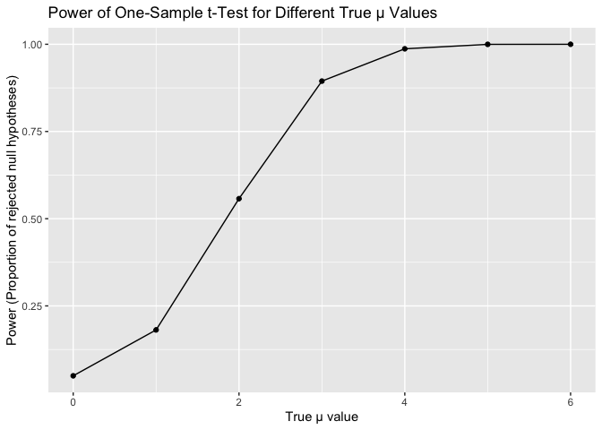
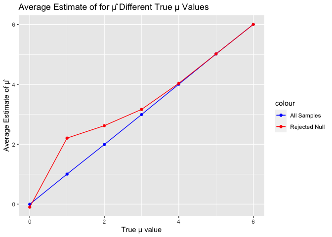

Homework5
================
Siyan Wen
2023-11-10

``` r
library(tidyverse)
```

    ## ── Attaching core tidyverse packages ──────────────────────── tidyverse 2.0.0 ──
    ## ✔ dplyr     1.1.3     ✔ readr     2.1.4
    ## ✔ forcats   1.0.0     ✔ stringr   1.5.0
    ## ✔ ggplot2   3.4.3     ✔ tibble    3.2.1
    ## ✔ lubridate 1.9.2     ✔ tidyr     1.3.0
    ## ✔ purrr     1.0.2     
    ## ── Conflicts ────────────────────────────────────────── tidyverse_conflicts() ──
    ## ✖ dplyr::filter() masks stats::filter()
    ## ✖ dplyr::lag()    masks stats::lag()
    ## ℹ Use the conflicted package (<http://conflicted.r-lib.org/>) to force all conflicts to become errors

``` r
library(rvest)
```

    ## 
    ## Attaching package: 'rvest'
    ## 
    ## The following object is masked from 'package:readr':
    ## 
    ##     guess_encoding

``` r
library(ggplot2)
library(broom)

set.seed(1)
```

## Problem 1

## Problem 2

#### Dataframe

``` r
list_name<-
  as.list(
  list.files(path = "data",full.names = TRUE)
  )
# Test if list_name is a list
is.list(list_name)
```

    ## [1] TRUE

``` r
file_name<-list.files(path = "data",full.names = FALSE)
```

``` r
output <-
  list_name|>
  map_dfr(read_csv,.id = NULL)
```

    ## Rows: 1 Columns: 8
    ## ── Column specification ────────────────────────────────────────────────────────
    ## Delimiter: ","
    ## dbl (8): week_1, week_2, week_3, week_4, week_5, week_6, week_7, week_8
    ## 
    ## ℹ Use `spec()` to retrieve the full column specification for this data.
    ## ℹ Specify the column types or set `show_col_types = FALSE` to quiet this message.
    ## Rows: 1 Columns: 8
    ## ── Column specification ────────────────────────────────────────────────────────
    ## Delimiter: ","
    ## dbl (8): week_1, week_2, week_3, week_4, week_5, week_6, week_7, week_8
    ## 
    ## ℹ Use `spec()` to retrieve the full column specification for this data.
    ## ℹ Specify the column types or set `show_col_types = FALSE` to quiet this message.
    ## Rows: 1 Columns: 8
    ## ── Column specification ────────────────────────────────────────────────────────
    ## Delimiter: ","
    ## dbl (8): week_1, week_2, week_3, week_4, week_5, week_6, week_7, week_8
    ## 
    ## ℹ Use `spec()` to retrieve the full column specification for this data.
    ## ℹ Specify the column types or set `show_col_types = FALSE` to quiet this message.
    ## Rows: 1 Columns: 8
    ## ── Column specification ────────────────────────────────────────────────────────
    ## Delimiter: ","
    ## dbl (8): week_1, week_2, week_3, week_4, week_5, week_6, week_7, week_8
    ## 
    ## ℹ Use `spec()` to retrieve the full column specification for this data.
    ## ℹ Specify the column types or set `show_col_types = FALSE` to quiet this message.
    ## Rows: 1 Columns: 8
    ## ── Column specification ────────────────────────────────────────────────────────
    ## Delimiter: ","
    ## dbl (8): week_1, week_2, week_3, week_4, week_5, week_6, week_7, week_8
    ## 
    ## ℹ Use `spec()` to retrieve the full column specification for this data.
    ## ℹ Specify the column types or set `show_col_types = FALSE` to quiet this message.
    ## Rows: 1 Columns: 8
    ## ── Column specification ────────────────────────────────────────────────────────
    ## Delimiter: ","
    ## dbl (8): week_1, week_2, week_3, week_4, week_5, week_6, week_7, week_8
    ## 
    ## ℹ Use `spec()` to retrieve the full column specification for this data.
    ## ℹ Specify the column types or set `show_col_types = FALSE` to quiet this message.
    ## Rows: 1 Columns: 8
    ## ── Column specification ────────────────────────────────────────────────────────
    ## Delimiter: ","
    ## dbl (8): week_1, week_2, week_3, week_4, week_5, week_6, week_7, week_8
    ## 
    ## ℹ Use `spec()` to retrieve the full column specification for this data.
    ## ℹ Specify the column types or set `show_col_types = FALSE` to quiet this message.
    ## Rows: 1 Columns: 8
    ## ── Column specification ────────────────────────────────────────────────────────
    ## Delimiter: ","
    ## dbl (8): week_1, week_2, week_3, week_4, week_5, week_6, week_7, week_8
    ## 
    ## ℹ Use `spec()` to retrieve the full column specification for this data.
    ## ℹ Specify the column types or set `show_col_types = FALSE` to quiet this message.
    ## Rows: 1 Columns: 8
    ## ── Column specification ────────────────────────────────────────────────────────
    ## Delimiter: ","
    ## dbl (8): week_1, week_2, week_3, week_4, week_5, week_6, week_7, week_8
    ## 
    ## ℹ Use `spec()` to retrieve the full column specification for this data.
    ## ℹ Specify the column types or set `show_col_types = FALSE` to quiet this message.
    ## Rows: 1 Columns: 8
    ## ── Column specification ────────────────────────────────────────────────────────
    ## Delimiter: ","
    ## dbl (8): week_1, week_2, week_3, week_4, week_5, week_6, week_7, week_8
    ## 
    ## ℹ Use `spec()` to retrieve the full column specification for this data.
    ## ℹ Specify the column types or set `show_col_types = FALSE` to quiet this message.
    ## Rows: 1 Columns: 8
    ## ── Column specification ────────────────────────────────────────────────────────
    ## Delimiter: ","
    ## dbl (8): week_1, week_2, week_3, week_4, week_5, week_6, week_7, week_8
    ## 
    ## ℹ Use `spec()` to retrieve the full column specification for this data.
    ## ℹ Specify the column types or set `show_col_types = FALSE` to quiet this message.
    ## Rows: 1 Columns: 8
    ## ── Column specification ────────────────────────────────────────────────────────
    ## Delimiter: ","
    ## dbl (8): week_1, week_2, week_3, week_4, week_5, week_6, week_7, week_8
    ## 
    ## ℹ Use `spec()` to retrieve the full column specification for this data.
    ## ℹ Specify the column types or set `show_col_types = FALSE` to quiet this message.
    ## Rows: 1 Columns: 8
    ## ── Column specification ────────────────────────────────────────────────────────
    ## Delimiter: ","
    ## dbl (8): week_1, week_2, week_3, week_4, week_5, week_6, week_7, week_8
    ## 
    ## ℹ Use `spec()` to retrieve the full column specification for this data.
    ## ℹ Specify the column types or set `show_col_types = FALSE` to quiet this message.
    ## Rows: 1 Columns: 8
    ## ── Column specification ────────────────────────────────────────────────────────
    ## Delimiter: ","
    ## dbl (8): week_1, week_2, week_3, week_4, week_5, week_6, week_7, week_8
    ## 
    ## ℹ Use `spec()` to retrieve the full column specification for this data.
    ## ℹ Specify the column types or set `show_col_types = FALSE` to quiet this message.
    ## Rows: 1 Columns: 8
    ## ── Column specification ────────────────────────────────────────────────────────
    ## Delimiter: ","
    ## dbl (8): week_1, week_2, week_3, week_4, week_5, week_6, week_7, week_8
    ## 
    ## ℹ Use `spec()` to retrieve the full column specification for this data.
    ## ℹ Specify the column types or set `show_col_types = FALSE` to quiet this message.
    ## Rows: 1 Columns: 8
    ## ── Column specification ────────────────────────────────────────────────────────
    ## Delimiter: ","
    ## dbl (8): week_1, week_2, week_3, week_4, week_5, week_6, week_7, week_8
    ## 
    ## ℹ Use `spec()` to retrieve the full column specification for this data.
    ## ℹ Specify the column types or set `show_col_types = FALSE` to quiet this message.
    ## Rows: 1 Columns: 8
    ## ── Column specification ────────────────────────────────────────────────────────
    ## Delimiter: ","
    ## dbl (8): week_1, week_2, week_3, week_4, week_5, week_6, week_7, week_8
    ## 
    ## ℹ Use `spec()` to retrieve the full column specification for this data.
    ## ℹ Specify the column types or set `show_col_types = FALSE` to quiet this message.
    ## Rows: 1 Columns: 8
    ## ── Column specification ────────────────────────────────────────────────────────
    ## Delimiter: ","
    ## dbl (8): week_1, week_2, week_3, week_4, week_5, week_6, week_7, week_8
    ## 
    ## ℹ Use `spec()` to retrieve the full column specification for this data.
    ## ℹ Specify the column types or set `show_col_types = FALSE` to quiet this message.
    ## Rows: 1 Columns: 8
    ## ── Column specification ────────────────────────────────────────────────────────
    ## Delimiter: ","
    ## dbl (8): week_1, week_2, week_3, week_4, week_5, week_6, week_7, week_8
    ## 
    ## ℹ Use `spec()` to retrieve the full column specification for this data.
    ## ℹ Specify the column types or set `show_col_types = FALSE` to quiet this message.
    ## Rows: 1 Columns: 8
    ## ── Column specification ────────────────────────────────────────────────────────
    ## Delimiter: ","
    ## dbl (8): week_1, week_2, week_3, week_4, week_5, week_6, week_7, week_8
    ## 
    ## ℹ Use `spec()` to retrieve the full column specification for this data.
    ## ℹ Specify the column types or set `show_col_types = FALSE` to quiet this message.

``` r
file_info <- data.frame(file_name_ = file_name) |>
  mutate(subject_id = gsub(".*_(\\d+)\\.csv", "\\1",file_name_ ),
         arm = gsub("^(con|exp)_.*", "\\1",file_name_ ))


result_df <-
  bind_cols(file_info,output)|>
  select(-file_name_)|>
  pivot_longer(week_1:week_8,
    names_to ="Time",
    values_to ="Observation"
  )|>
  group_by(subject_id,arm)
```

#### Plot

``` r
 ggplot(result_df, aes(x = Time, y = Observation, group=subject_id, color = subject_id)) +
  geom_line() +
  labs(title = "Spaghetti Plot of Observations by Subject Over Time", x = "Time", y = "Observation") +
  theme_minimal()+
  facet_wrap(~arm, nrow = 2)
```

<!-- -->

There was a slight fluctuation in the observed values for each subject
of the control group from week one to week eight. However, for the
experimental group, the observed values basically went up from week one
to week eight in general. In sum, the differences between control and
experimental groups increased as the time goes by.

## Problem 3

#### Simulation

``` r
# Function to simulate data from a normal distribution, conduct t-test, and obtain p-value
simulate_t_test <- function(n, mu, sigma, alpha) {
  sim_data <- rnorm(n, mean = mu, sd = sigma)
  t_test_result <- t.test(sim_data, mu = 0)
  tidy(t_test_result)|>
    select(estimate, p.value)
}

# Perform the simulation using map

result <- map_dfr(1:5000, ~ simulate_t_test(30, 0, 5, 0.05))

# Calculate power: Proportion of p-values less than alpha
power <- mean(result$p.value < 0.005)

power
```

    ## [1] 0.0056

``` r
# Set parameters
mu_v<-0:6
# Repeat
results <- map_dfr(mu_v, function(mu) {
  tibble(
    mu = rep(mu, 5000),
    results = map(1:5000, ~ simulate_t_test(30, mu, 5, 0.05))
  )
}) |>
unnest(results)

power_by_mu <- 
  results |>
  group_by(mu) |>
  summarize(power = mean(p.value < 0.05))
```

#### Plot

``` r
ggplot(power_by_mu, aes(x = mu, y = power)) +
  geom_line() +
  geom_point() +
  labs(x = "True μ value", y = "Power (Proportion of rejected null hypotheses)") +
  ggtitle("Power of One-Sample t-Test for Different True μ Values")
```

<!-- -->

With the true $\mu$ value getting higher, the power of test is getting
closer and closer to 1.

``` r
avg_estimate_all <- 
  results |>
  group_by(mu) |>
  summarize(avg_estimate = mean(estimate))

avg_estimate_rejected <- 
  results |>
  filter(p.value < 0.05) |>
  group_by(mu) |>
  summarize(avg_estimate_rejected = mean(estimate))

# Merge the two datasets for plotting
combined_data <- merge(avg_estimate_all, avg_estimate_rejected, by = "mu", all = TRUE)

# Plotting the average estimate of μ̂ against true μ values
ggplot(combined_data, aes(x = mu)) +
  geom_line(aes(y = avg_estimate, color = "All Samples")) +
  geom_point(aes(y = avg_estimate, color = "All Samples")) +
  geom_line(aes(y = avg_estimate_rejected, color = "Rejected Null")) +
  geom_point(aes(y = avg_estimate_rejected, color = "Rejected Null")) +
  labs(x = "True μ value", y = "Average Estimate of μ̂") +
  scale_color_manual(values = c("All Samples" = "blue", "Rejected Null" = "red")) +
  ggtitle("Average Estimate of for μ̂ Different True μ Values")
```

<!-- -->

The sample average of $\mu$ across tests for which the null is rejected
is approximately equal to the true value of $\mu$ when $\mu$
increases.The reason why this is the case is the following:

When true population mean ($\mu=0$),the overall average estimate μ̂ and
the rejected group average μ̂ estimate are expected to be zero.

When true population mean ($\mu$) started to increase from 0, the group
that fails to reject the null hypothesis tends to have a estimate μ̂
closer to zero. Since the true population mean is higher than zero, the
estimation μ̂ is a little bit higher than the true population mean as
well.

When true population mean ($\mu$) continues increases and get closer to
6, the actual mean of the population is farther away from the null
hypothesis value, so the likelihood of rejecting the null hypothesis
will increases. That means the average estimate of only in samples for
which the null was rejected will move closer to the true population
mean.
